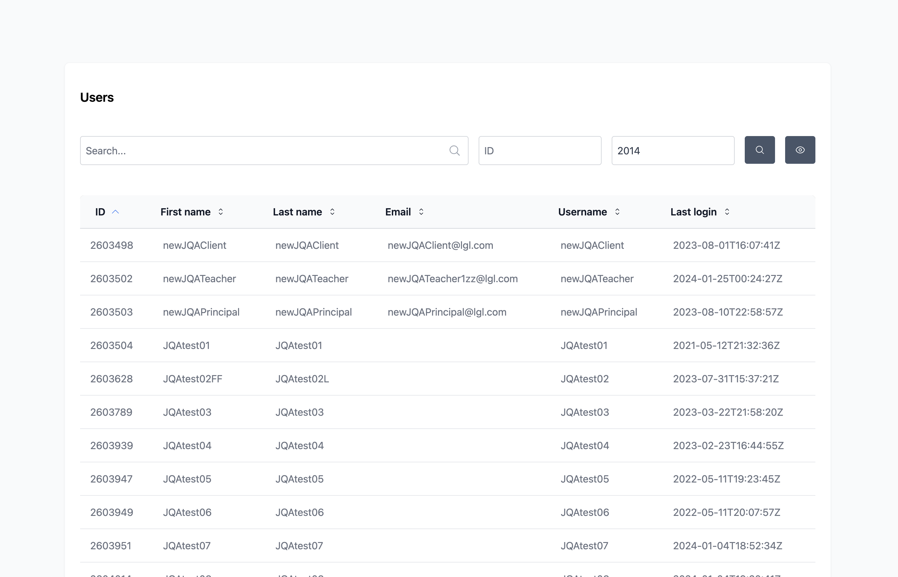

# Go Tables backend for Inertia Vue Table

[](https://github.com/humweb/go-tables/releases)
[](https://pkg.go.dev/github.com/humweb/go-tables)
[](go.mod)
[](LICENSE)
[](https://github.com/humweb/go-tables/actions?query=workflow%3Abuild+branch%3Amain)
[](https://goreportcard.com/report/github.com/humweb/go-tables)
[](https://codecov.io/gh/humweb/go-tables)

⭐ `Star` this repository if you find it valuable and worth maintaining.

👁 `Watch` this repository to get notified about new releases, issues, etc.

## Description

Companion backend for [inertia-vue-tables](https://humweb.github.io/inertia-vue-table/guide/getting-started.html)

**Features**
* Custom filters
* Field Search
* Global Search
* Column Sorting
* Length Aware Pagination
* Record limit per page

## Preview


<br>

---

## Example Resource

```go
package tables

import (
	"gorm.io/gorm"
	"net/http"
	"strconv"
)

type UserResource struct {
	AbstractResource
}

func NewUserResource(db *gorm.DB, req *http.Request) *UserResource {
	r := &UserResource{
		AbstractResource{
			Table:           "users",
			Db:              db,
			Request:         req,
			HasGlobalSearch: true,
		},
	}

	r.Fields = r.GetFields()
	r.Filters = r.GetFilters()

	return r
}

func (u *UserResource) GetModel() string {
	return "users"
}

func (u *UserResource) GetFields() []*Field {
	return []*Field{
		NewField("ID", WithSortable()),
		NewField("First name", WithSortable(), WithVisibility()),
		NewField("Last name", WithSortable(), WithSearchable()),
		NewField("Email", WithSortable()),
		NewField("Username", WithSortable()),
		NewField("Last login", WithSortable()),
	}
}

func (u *UserResource) GetFilters() []*Filter {
	return []*Filter{
		NewFilter("ID"),
		NewFilter("Client ID"),
	}
}

func (u *UserResource) ApplyFilter(db *gorm.DB) {

	//if clientId := chi.URLParam(u.Request, "client"); clientId != "" {
	//	db.Where("client_id = ?", clientId)
	//}
	//
	//if siteId := chi.URLParam(u.Request, "site"); siteId != "" {
	//	db.Joins("inner join sites_users ON sites_users.user_id = users.id").Where("sites_users.site_id = ?", siteId)
	//}
}

func (u *UserResource) WithGlobalSearch(db *gorm.DB, val string) {

	if v, err := strconv.Atoi(val); err == nil {
		db.Where("id = ?", v)
	} else {
		val = "%" + val + "%"
		db.Where(
			db.Where(db.Where("first_name ilike ?", val).Or("last_name ilike ?", val).Or("email ilike ?", val)),
		)
	}
}

```

## HTTP Handler Example
```go
func (h UsersHandler) HandleGetUsers(w http.ResponseWriter, r *http.Request) {

	resource := resources.NewUserResource(h.App.Db, r)
	
	response, _ := resource.Paginate(resource)

	_ = h.App.Inertia.Render(w, r, "Users", response)
}

```

## Contributing

Feel free to create an issue or propose a pull request.

Follow the [Code of Conduct](CODE_OF_CONDUCT.md).
